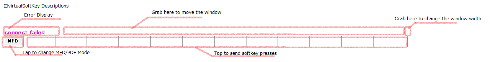

# virtualSoftKey

Send WorkingTitle G1000 Nxi soft key presses (H:AS1000_PFD_SOFTKEYS_[0-9] / H:AS1000_MFD_SOFTKEYS_[0-9]) to MSFS via FSUIPC WASM module.

Used to pop out a G1000 window on the touch screen display.

## Description

### Video Demo(with debug messages)

### Descriptions

## Getting Started

### Prerequisite

**1. The FSUIPC WASM Mudule is required**

Get the FSUIPC WASM Module from Additional Free Software Section of [Pete & John Dowson's Software](http://fsuipc.com) website and install the **fsuipc-lvar-module** to the MSFS Community folder.

(You do \*not* need install FSUIPC itself.)

 

**2. The \<aircraft title>.hvar file for the WASM Module is reqired.**

The file is stored here.

Commmunity\\fsuipc-lvar-module\\modules\\\<aircraft title>.hvar 

if it does not exist, just copy the **DA40-NG.hvar** file to **\<your aircaft title>.hvar**.

The aircraft title can be found in *<the aircraft folder\SimObject\Airplanes\aircraft.cfg>*.

Like this: **Title="xxxx"**

See [the forum posts](https://forum.simflight.com/topic/92031-wasm-module-client-api-for-msfs-fsuipc7-now-available/) for more information. 

### How to use 

Just run *vitualSoftKey.exe* and move it over the avobe G1000 pop-out panel.

## Help

* The error display says *connect failed* even when running MSFS.

You need to install FSUIPC **WASM Module**.(not FSUIPC)

* Nothing happens when I tap.

You need to store \<aircraft title>.hvar file to WASM Module folder.

## Author

ti360✍ https://twitter.com/ti360

## Version History

* 0.1.0.0
    * Initial Release
* 0.2.0.0
    * Added "Lock Position" context menu.
    * PFD/MFD mode now saved.

* 0.2.1.0
    * Added an About box.

## License

This project is licensed under the MIT License - see the LICENSE.md file for details

Uses the [FSUIPC Client DLL for .NET](http://fsuipc.paulhenty.com/) by Paul Henty 

